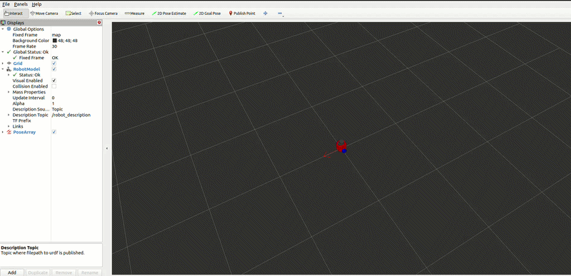
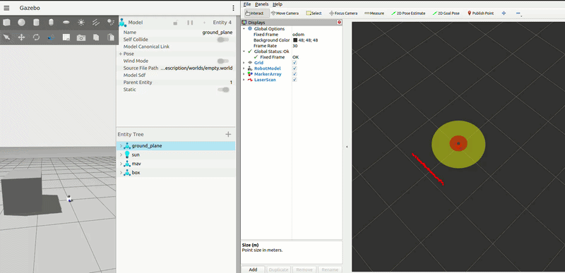
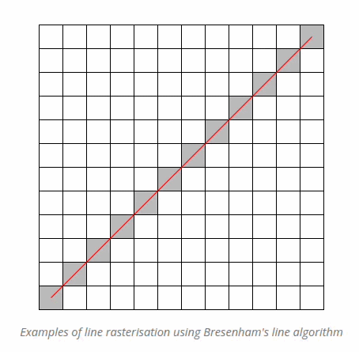
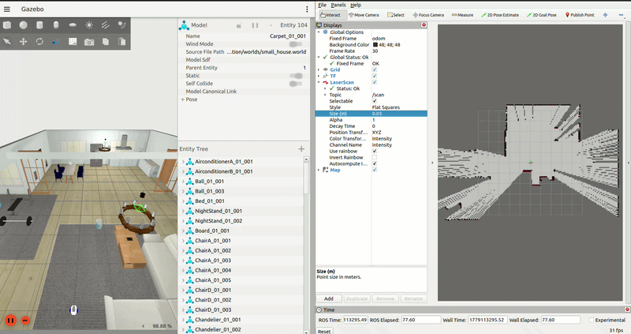

# MAV-1.0

An advanced mobile robot simulation environment focused on autonomous navigation, state estimation under uncertainty, and reactive safety control.

---

## Project Upgrades (MAV-1.0 vs Previous Version)

This version introduces major upgrades to improve robot localization, state estimation accuracy, and collision avoidance:

### 1. Probabilistic Odometry Motion Model
Standard deterministic odometry accumulates kinematic errors over time. To address this, a probabilistic motion model has been implemented using a particle filter approach:
* **Particle-Based Estimation:** The model utilizes a set of particles to represent the probability distribution of the robot's possible poses, predicting the exact state at any given time step.
* **Error Propagation Mitigation:** By modeling motion uncertainties stochastically, the system handles sensor noise and cumulative errors, resulting in highly accurate robot localization.



---

### 2. Speed Monitoring and Collision Avoidance Logic
To prevent hardware and simulation collisions, a safety system has been integrated into the velocity command pipeline using LiDAR sensor data and the `twist_mux` package. The surroundings of the robot are monitored through defined safety zones:

* **Warning Zone (Yellow):** When an obstacle enters the outer threshold, the robot's linear and angular velocities are automatically decreased to ensure safe maneuvering.
* **Danger Zone (Red):** When an obstacle breaches the critical inner radius, a ROS 2 Action Node is triggered immediately to execute an emergency stop and preempt lower-priority velocity commands.



---

### 3. Navigation Stack (Nav2) Implementation & Configuration
This version starts the integration of the Nav2 stack, focusing on map hosting, Quality of Service (QoS) tuning, and node lifecycle management:

* **Map Server & QoS Compatibility:** The `map_server` tool was configured to host the occupancy grid map for other applications. Initially, RViz2 failed to display the map hosted by the map server. The issue was a QoS durability policy mismatch. Standard configuration only delivers transient messages, whereas map visualization requires historical data persistence. To resolve this, the RViz2 QoS Durability policy was changed to **Transient Local** to match the Nav2 map server settings, enabling proper map data visualization.


* **Lifecycle Manager Integration:** To handle system initialization and state transitions, the `lifecycle_manager` tool was integrated. This component is responsible for configuring, transitioning, and activating the ROS 2 lifecycle nodes in the correct sequential order, ensuring a reliable boot sequenc for the navigation system.

---
### 4. Probabilistic Occupancy Grid Mapping (Mapping with Known Poses)
To build an accurate environment map from noisy sensor data, a custom 2D probabilistic occupancy grid mapping algorithm was implemented from scratch using Python and NumPy. 

#### Core Mapping Concept
Instead of a simple binary map (0 or 1), the environment is discretized into a 2D grid where each cell maintains a continuous probability belief of being **Occupied**, **Free**, or **Unknown**. 
* **Ray Casting via Bresenham's Algorithm:** For every laser beam from the `LaserScan` message, Bresenham's line algorithm traces the cells from the robot's current pose to the obstacle hit point.
* **Inverse Sensor Model Application:** All grid cells traversed along the beam's path are updated as **Free**, while the final cell where the beam detects a hit is marked as **Occupied**. Unobserved areas remain **Unknown**.



#### Why Probabilistic Mapping & Bayesian Update?
Real-world LiDAR data and robot localization are inherently uncertain (sensor noise, missing reflections, slips). To mitigate this, a **Log-Odds Bayesian Filter** recursively updates the map's confidence over time. 

The update equation is implemented as:
`L_t(x) = L_{t-1}(x) + Log_Odds(p(x | z_t)) - L_0`

Where:
* `L_t(x)` is the updated log-odds belief of the cell.
* `L_{t-1}(x)` is the previous belief historical state.
* `Log_Odds(p(x | z_t))` is the inverse sensor model measurement input.
* `L_0` is the prior belief anchor.

Using the log-odds representation avoids numerical underflow/overflow stability issues and simplifies calculation by converting complex probability multiplications into rapid, real-time additions.

#### Visualization in RViz2
To maintain high computational performance, the algorithm applies an independence approximation across cells. The resulting occupancy grid is streamed directly to RViz2:
* **Black cells:** High probability of occupation (Obstacles).
* **White cells:** Cleared space (Free zones).
* **Gray cells:** Unexplored space (Unknown limits).


---

### 5. Robot Localization via AMCL (Adaptive Monte Carlo Localization)
For tracking the robot’s state within a known static map under uncertainty, the Nav2 **AMCL** package was integrated:
* **Particle Filter Localization:** AMCL uses a multi-hypothesis particle filter to track the robot's pose. Each particle represents a possible pose, and the cloud converges as the robot moves and observes features via LiDAR.
* **KLD-Sampling Efficiency:** The algorithm dynamically adjusts the number of particles (Kullback-Leibler Divergence sampling). When the robot's pose is highly uncertain, the particle count increases; once localized, the particle cloud shrinks to conserve CPU resources.
* **Transform Integration:** AMCL dynamically publishes the critical `map` to `odom` coordinate frame transform, correcting the low-frequency drift accumulated by the wheel odometry hardware.

---

### 6. Simultaneous Localization and Mapping (SLAM) via Slam Toolbox
While multiple SLAM paradigms exist (such as Particle Filter SLAM like Gmapping, EKF SLAM, or legacy Graph SLAM options), this project utilizes **Slam Toolbox**—the industry standard for modern ROS 2 navigation.

* **Pose-Graph SLAM Architecture:** Unlike legacy particle filter methods that suffer from computational scaling issues in large environments, Slam Toolbox utilizes a sparse pose-graph optimization technique to manage constraints.
* **Loop Closure & Optimization:** The module actively detects when the robot revisits known areas (Loop Closure), triggering a global optimization routine to correct map deformations and historical localization drift in real time.
* **Lifelong Mapping Capabilities:** It supports continuous, long-term mapping routines, allowing the robot to load an existing map, execute further exploration, refine the geometry, and save the updated environment state seamlessly.

#### 🎬 Full SLAM & Navigation Demo
Check out the complete demonstration of the autonomous mapping and navigation system in action:


---

## Environment & Prerequisites

* **Operating System:** Ubuntu 22.04 LTS
* **Middleware:** ROS 2 (Humble)
* **Architecture Support:** ARM64 / AMD64 (Optimized for PC and Raspberry Pi deployment)
* **Containerization:** Docker

---

## Getting Started

### 1. Build the Workspace
Clone the repository into your ROS 2 workspace, then build and source the packages:
```bash
cd ~/ros2_ws
colcon build --symlink-install
source install/setup.bash
