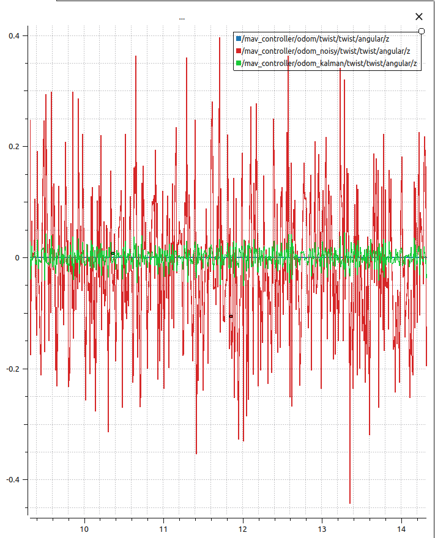
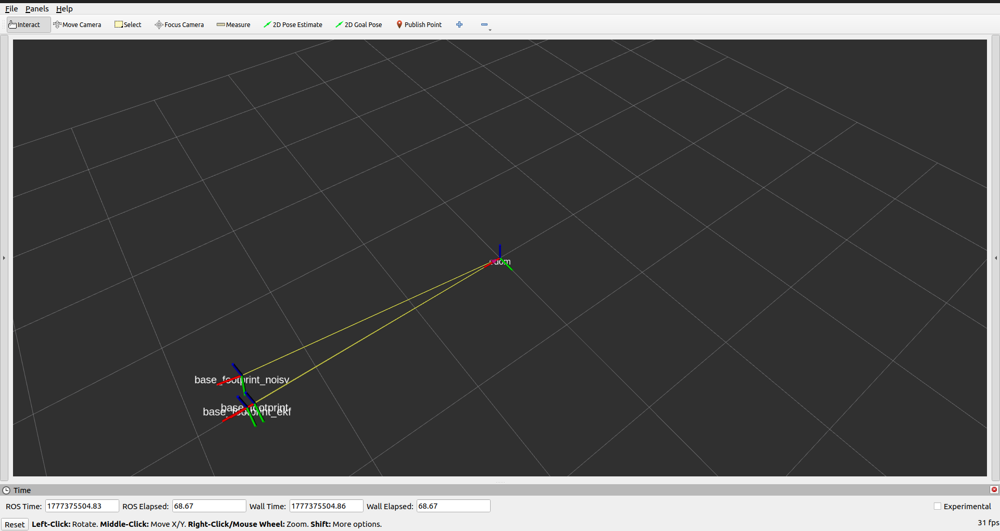

# MAV ROS2 Differential Drive Robot

This project is a ROS2-based simulation and control system for a differential drive robot (MAV).  
It focuses on control, state estimation, and sensor fusion using custom implementations and ROS2 tools.

---

## Project Overview

The system is divided into 4  main packages:

### 1. mav_description
- Robot URDF/Xacro model
- Gazebo simulation setup
- ROS2 Control integration
- RViz visualization launch files

---

### 2. mav_controller
- Differential drive kinematics model
- Inverse kinematics for control
- Custom odometry estimation
- Noisy controller for simulating real encoder noise
- Joystick (PS4) teleoperation support

---

### 3. mav_localization
- Extended Kalman Filter (EKF) using `robot_localization`
- Custom Kalman Filter for angular Z estimation
- IMU + encoder fusion
- Comparison between raw, noisy, and filtered odometry

---

## Sensor Fusion Results

### Custom Kalman Filter Output
This shows the implemented filter for angular stability:

---

### EKF using robot_localization
This shows the fused odometry from IMU + wheel encoders:

---

## 4. real_mav 

- simple serial transmitter node
- arduino code for motor control 
- ex. command to send in the serial topic :
(rp0.00,lp0.00,)
- r : right , l : left
- p : positive , n : negative 
- (0.00 - 13.00) rad/sec #depending on the motor

---

 
## Key Features

- Full ROS2 simulation pipeline
- kinematics and odometry implementation
- Noise injection for realistic encoder behavior
- EKF-based localization using ROS2 standard package
- Performance comparison between custom filter and EKF

---

## Goal of the Project

The goal is to understand:
- Mobile robot kinematics
- Odometry estimation errors
- Sensor fusion techniques
- Practical EKF implementation in ROS2

---

## Author
Abdalluh Husain
