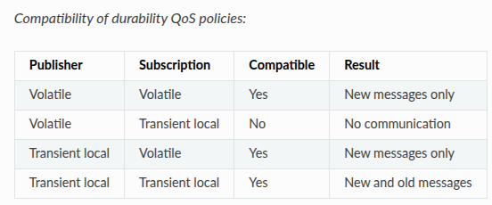

# MAV-1.0

An advanced mobile robot simulation environment focused on autonomous navigation, state estimation under uncertainty, and reactive safety control.

---

## Project Upgrades (MAV-1.0 vs Previous Version)

This version introduces major upgrades to improve robot localization, state estimation accuracy, and collision avoidance:

### 1. Probabilistic Odometry Motion Model
Standard deterministic odometry accumulates kinematic errors over time. To address this, a probabilistic motion model has been implemented using a particle filter approach:
* **Particle-Based Estimation:** The model utilizes a set of particles to represent the probability distribution of the robot's possible poses, predicting the exact state at any given time step.
* **Error Propagation Mitigation:** By modeling motion uncertainties stochastically, the system handles sensor noise and cumulative errors, resulting in highly accurate robot localization.


---

### 2. Speed Monitoring and Collision Avoidance Logic
To prevent hardware and simulation collisions, a safety system has been integrated into the velocity command pipeline using LiDAR sensor data and the `twist_mux` package. The surroundings of the robot are monitored through defined safety zones:

* **Warning Zone (Yellow):** When an obstacle enters the outer threshold, the robot's linear and angular velocities are automatically decreased to ensure safe maneuvering.
* **Danger Zone (Red):** When an obstacle breaches the critical inner radius, a ROS 2 Action Node is triggered immediately to execute an emergency stop and preempt lower-priority velocity commands.


---

### 3. Navigation Stack (Nav2) Implementation & Configuration
This version starts the integration of the Nav2 stack, focusing on map hosting, Quality of Service (QoS) tuning, and node lifecycle management:

* **Map Server & QoS Compatibility:** The `map_server` tool was configured to host the occupancy grid map for other applications. Initially, RViz2 failed to display the map hosted by the map server. The issue was a QoS durability policy mismatch. Standard configuration only delivers transient messages, whereas map visualization requires historical data persistence. To resolve this, the RViz2 QoS Durability policy was changed to **Transient Local** to match the Nav2 map server settings, enabling proper map data visualization.



* **Lifecycle Manager Integration:** To handle system initialization and state transitions, the `lifecycle_manager` tool was integrated. This component is responsible for configuring, transitioning, and activating the ROS 2 lifecycle nodes in the correct sequential order, ensuring a reliable boot sequenc for the navigation system.

## Environment & Prerequisites

* **Operating System:** Ubuntu 22.04 LTS
* **Middleware:** ROS 2 (Humble)
* **Architecture Support:** ARM64 / AMD64 (Optimized for PC and Raspberry Pi deployment)
* **Containerization:** Docker

---

## Getting Started

### 1. Build the Workspace
Clone the repository into your ROS 2 workspace, then build and source the packages:
```bash
cd ~/ros2_ws
colcon build --symlink-install
source install/setup.bash
